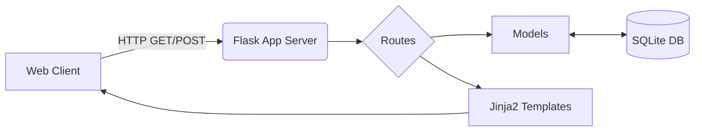

# ☕ Gen X Cafe Site

A fully responsive, dynamic cafe website utilizing a Model-View-Controller (MVC) architecture built in Python (Flask).

## 🚀 Live Demo
[https://genx-cafe-site-kame.onrender.com/](https://genx-cafe-site-kame.onrender.com/)

## 🏗 System Architecture
This application follows a traditional web server model with a robust template engine.
- **Routing**: Flask handles URL routing and HTTP methods in `app.py` & `routes/`.
- **Database**: SQLite manages menu items, orders, and users (defined in `schema.sql` and `models/`).
- **Templating**: Jinja2 renders dynamic content in `templates/`, stylized by CSS in `static/`.

## 🛠 Setup & Deployment
1. Install Python dependencies: `pip install -r requirements.txt`
2. Initialize the database: `sqlite3 db.sqlite3 < schema.sql`
3. Run the development server: `python app.py`

For production on Render, the included `Procfile` configures Gunicorn to serve the WSGI application automatically.
